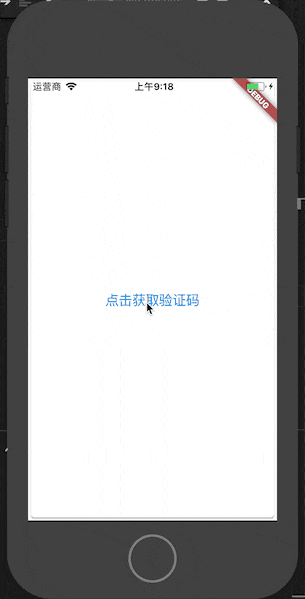

# flutter_countdown

An easy way to use count down

## How to use flutter_countdown

1. Open the `pubspec.yaml` file, and add `flutter_countdown: <latest_version>` unde `dependencies`:
```
  dependencies:
    flutter:
      sdk: flutter
    # ...
    # ...
    flutter_countdown: ^0.1.0
```

2. install it from terminal: Run `flutter packages get`

## Example



``` dart
import "package:flutter/material.dart";
import 'package:flutter_countdown/countdown.dart';

void main() {
  runApp(Example());
}

class Example extends StatelessWidget {
  final int beginCount = 5;
  
  @override
  Widget build(BuildContext context) {
    return new Scaffold(
      body: new Card(
          child: new Center(
        child: CountDown(
          renderSemanticLabel: (count) {
            if (count == beginCount) {
              return "点击获取验证码";
            }
            return "$count 秒后重试";
          },
          beginCount: beginCount,
          endCount: 0,
          onPress: (ctr) {
            if (ctr.isAnimating) {
              return  Future.value(false);
            }
            return Future.value(true);
          }
        ),
      )),
    );
  }
}
```
